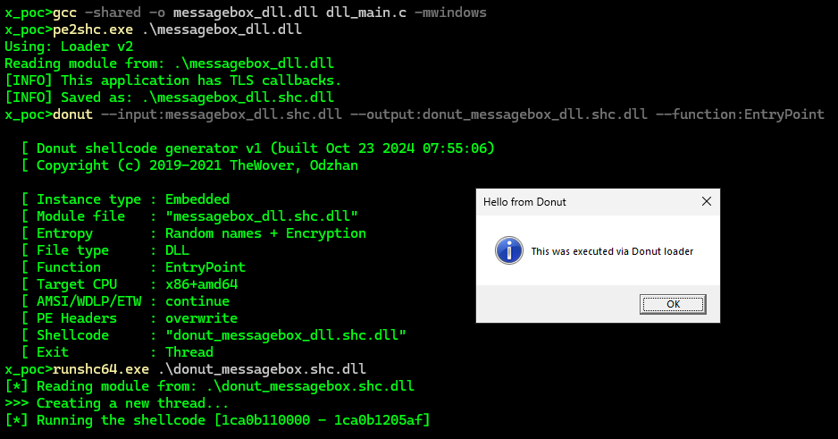
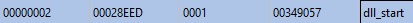

# scepter-rs

A Rust-based command and control (C2) relationship designed to maximize compatability with non-standard devices. `scepter-rs` provides a minimal command and control interface that can be leveraged from [your favorite C2 framework](https://www.cobaltstrike.com/).

Similar in design to [rssh-rs](https://github.com/0xTriboulet/rssh-rs/tree/master), this project enables external capability to be deployed from a Beacon console, effectively providing primitive support for 3rd-party pivot Agents from an existing Beacon session.

## Project Components

- **scepter-server**: The command server that manages connections and facilitates communication with agents
- **scepter-agent**: The client-side agent that executes commands on target systems
- **scepter-common**: Shared code and utilities used by both server and agent components
- **bof-write-pipe**: Utility for writing to communication pipes
- **xtask**: Custom build scripts and development tools

## Features

- Cross-platform support for various operating systems
- Encrypted communications between server and agents
- Modular design allowing for easy extension
- Integration with Cobalt Strike via Aggressor scripts (.cna)
- Customizable command execution and data exfiltration

## Getting Started

### Prerequisites

- Rust toolchain (specified in rust-toolchain.toml)
- Cargo package manager
- [pe2shc](https://github.com/hasherezade/pe_to_shellcode/tree/master)
- [cargo-zigbuild](https://github.com/rust-cross/cargo-zigbuild)

### Building from Source
The project uses a workspace structure to manage multiple related crates. The `xtask` crate provides custom build commands.

1. Clone the repository:
   ```bash
   git clone https://github.com/yourusername/scepter-rs.git
   cd scepter-rs
   cargo run --bin xtask --release
   ```
**Note: Apple aarch64 and x64 were manually built due to shortfalls in cargo-zigbuild's compatibility on Windows environments**
3. The compiled binaries will be available in the `bins/` directory.

### Usage

#### Agent Deployment

Agents can be compiled for a variety of platforms. `scepter-rs.cna` stomps in connection information provided in the `.cna` as well as from the Beacon console as necessary. The `scepter_server` is initialized via the `scepter-init` command in a Beacon console.

This project contains (untested/experimental) pre-built Agent binaries in the `bins/` folder, supporting:
- Windows x64
- Windows aarch64
- Linux x64
- Linux aarch64
- Apple x64
- Apple aarch64

#### Cobalt Strike Integration

The included `scepter-rs.cna` script provides integration with Cobalt Strike:

1. Load the script in your Cobalt Strike client
2. Use the provided interface to manage Scepter agents

#### Applying Other Reflective Loaders

For proof-of-concept functionality, `scepter-rs` applies `pe2shc`'s reflective loader to `scepter_server.windows.x64.dll`. However, one of the really cool capabilities of `pe2shc` is that the output PE retains all functionality of the original. This means that you can apply your own "obfuscation"-enabled reflective loader on-top without any negative effects at run time.


To facilitate using additional/alternative reflective loaders, `scepter_server.windows.x64.dll` exports `dll_start` as an alternate entry point for loaders that allow for the specification of entry points (for example Donut's `--function` option).


This capability is theoretical and untested. Feedback is welcome.